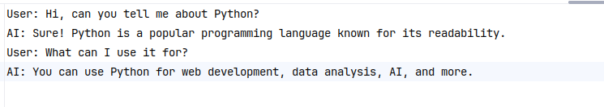

# AI-Chat-Log-Summarizer

This project is a Python-based tool developed to summarize chat logs between a user and an AI. It parses `.txt` files, extracts message statistics, identifies frequent keywords (excluding stop words), and generates a concise summary. The project showcases basic NLP skills, with an optional TF-IDF-based keyword extraction feature.

## Project Overview

- **Task**: Summarize AI chat logs (e.g., User: question → AI: response) into a report with message counts, conversation nature, and top keywords.
- **Features**:
  - Parse chat logs by speaker (User, AI).
  - Compute total messages and speaker-wise counts.
  - Extract top 5 keywords (excluding stop words).
  - Generate a summary (e.g., exchanges, topics, keywords).
  - TF-IDF for advanced keyword extraction.
- **Environment**: Python 3.12.3, compatible with Google Colab or local setup.
- **Tools**: `pandas`, `scikit-learn`, `transformers`, `datasets`, `torch`.

## Project Structure

```
AI-Chat-Log-Summarizer/
   ├── src/
       ├── __init__.py
       ├── chat_handler.py
       ├── main.py
       ├── settings.py
       ├── finetune/
           ├── checkpoint-510/
           ├── datasets/
           ├── inferences/
           ├── models/
           ├── tokenizers_/
           ├── __init__.py
       ├── notebooks/
           ├── finetune_t5_model.ipynb
   ├── chats/
       ├── text.txt
   ├── .env
   ├── README.md
   ├── requirements.txt

```
## Installation

1. **Clone the Repository**:
   ```bash
   git clone https://github.com/imsnto/AI-Chat-Log-Summarizer.git
   cd AI-Chat-Log-Summarizer
   ```

2. **Set Up Environment**:
   - Create and activate a virtual environment
     ```bash
     python3 -m venv .venv
     source .venv/bin/activate
     ```
   - Install dependencies:
     ```bash
     pip install -r requirements.txt
     ```

3. **Configure `.env`**:
   - Create a `.env` file in `AI-Chat-Log-Summarizer/` with:
   ```
    CHECKPOINT_PATH=finetune/checkpoint-510
    FOLDER_PATH=../chats
    ```
   - Adjust paths as needed.
4. **Download checkpoint and extract**
    ```bash
   https://drive.google.com/file/d/1-2Y8rjt6pF44q1FqyuQvzYkv-mdDaE4Z/view?usp=drive_link
   ```
   extract the zip file and copy all the files to this folder `src/finetune/checkpoint-510/`.

5. **Prepare Data**:
   - Place chat logs (e.g., `chat.txt`) in `AI-Chat-Log-Summarizer/chats/`. Sample format:
     ```
     User: Hello!
     AI: Hi! How can I assist you today?
     User: Can you explain what machine learning is?
     AI: Certainly! Machine learning is a field of AI that allows systems to learn from data.
     ```

## Usage

### Running the Summarizer
- Execute `main.py` to process the chat log:
  ```bash
  python src/main.py
  ```
  
## Input/Outputs
**Sameple-1**

 

**Response**


**Sample-2**

 

**Response**


**Sample-3**





**Response**


